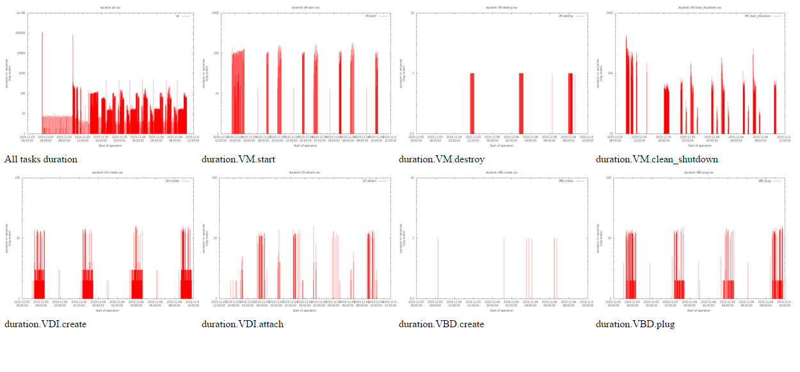

# xslogparse
auto processing of xenserver xensource.log

ref: http://xenserver.org/partners/developing-products-for-xenserver/20-dev-hints/90-xs-log-debug-understand.html

Sample Graphs:
==============
##Duration of a few selected tasks:

